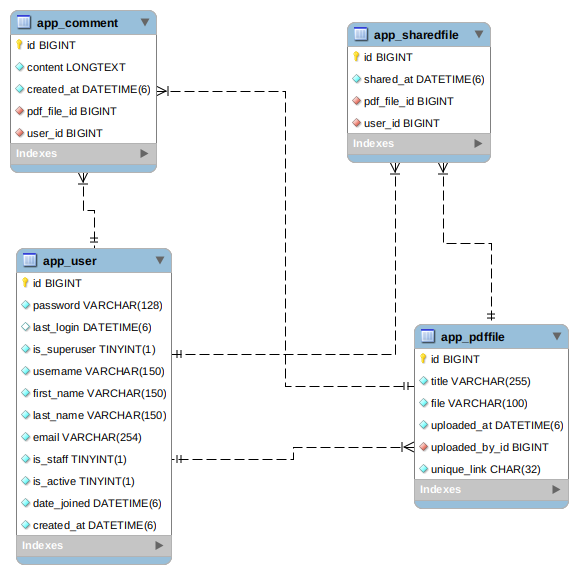
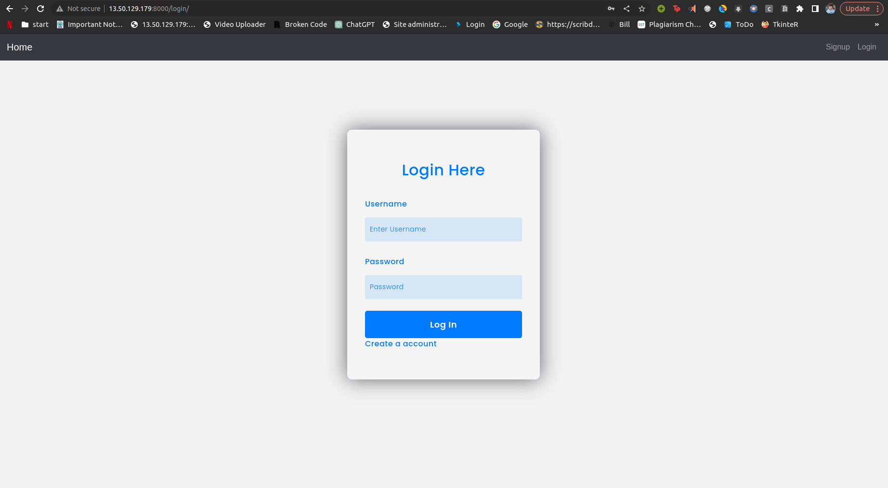
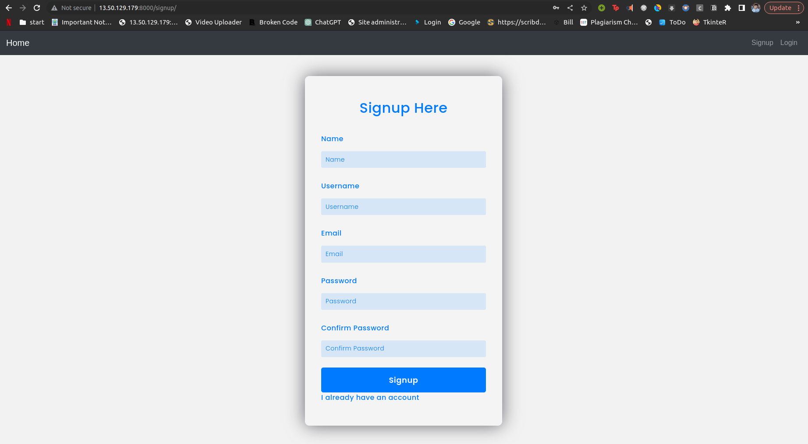
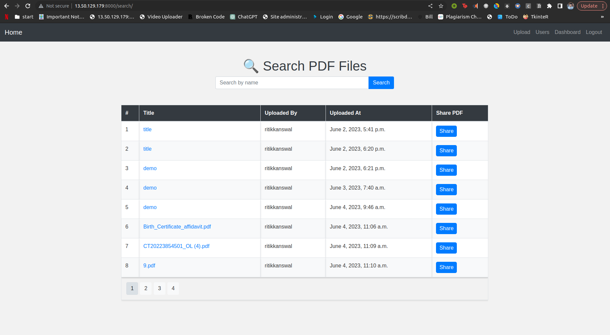
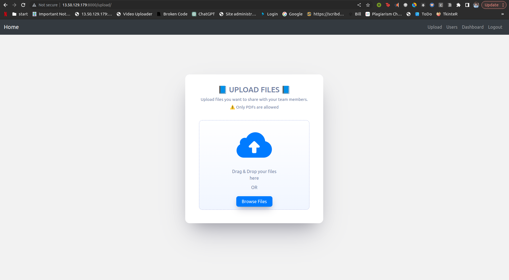
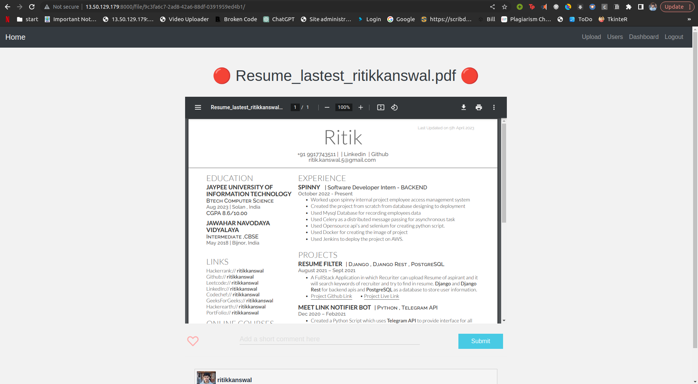
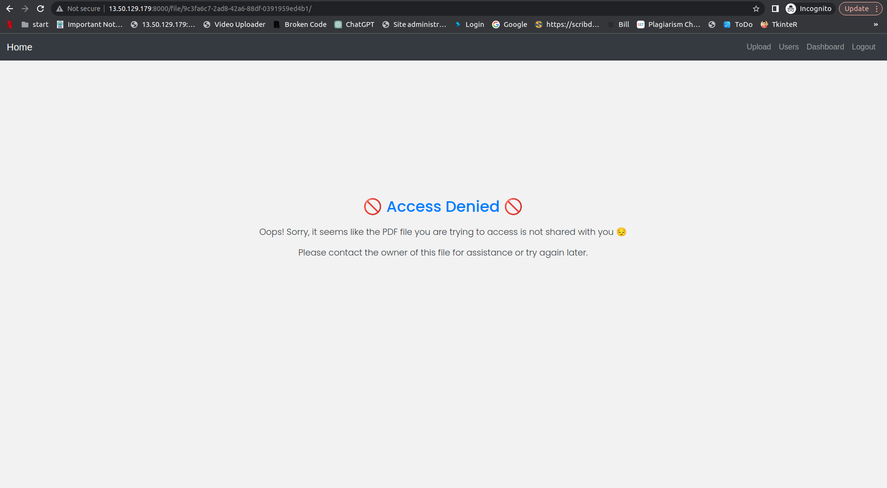
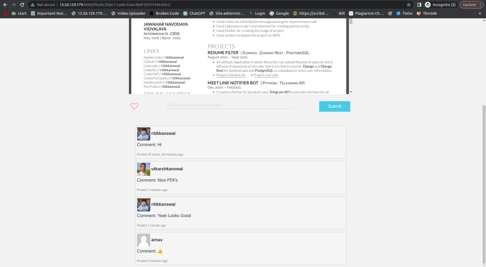
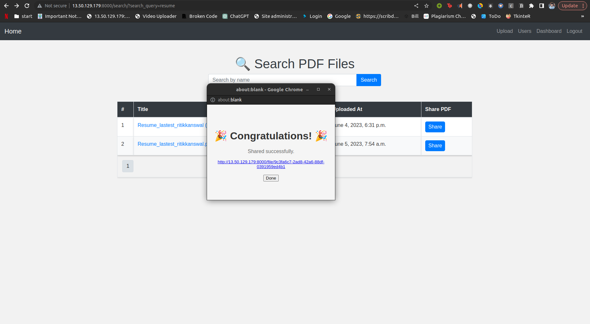

# PDF Management & Collaboration System

The PDF Management & Collaboration System is a web application designed to facilitate the seamless management and collaboration of PDFs. The system allows users to sign up, upload PDFs, share them with other users, and collaborate through comments.

### Features

1. **Introduction**: The PDF Management & Collaboration System is a web application designed to facilitate the seamless management and collaboration of PDFs. This section provides an overview of the system and its purpose.
2. **User Signup and Authentication**: Users can create an account by providing essential information such as name, email address, and password. Authentication mechanisms should be implemented to ensure secure access to the application.
3. **File Upload**: Authenticated users can upload a PDF file to the system. The PDF files should be securely stored and accessible only to authorized users. The application should validate the uploaded files to ensure they are in PDF format.
4. **Dashboard**: Users should be able to search for PDF files based on file names and view all the comments associated with a specific PDF file.
5. **File Sharing**: Users should have the ability to share PDF files with others by generating a unique link. Invited users may not have authenticated accounts to access shared PDF files.
6. **Invited User File Access and Commenting**: Invited users should be able to access shared PDF files through their invite link. The system should provide a user-friendly interface to view the PDF files, and invited users can add comments related to the PDF file on a sidebar.
7. **Security and Data Privacy**: Access controls should be in place to ensure that only authorized users can access PDF files and comments. User passwords should be securely hashed and stored.
8. **User Interface and Design**: The application should have an intuitive and user-friendly interface with responsive design to support various devices and screen sizes. The UI should provide clear navigation, a PDF file preview, and easy-to-use commenting features.

### Future Scope (to be added soon)

1. **User Signup and Authentication**: User authentication should support features like password reset and account recovery.
2. **File Sharing**: Send an email to the invitee when sharing a PDF.
3. **Invited User File Access and Commenting**: Users should be able to reply to existing comments. The system should support basic text formatting options (bold, italic, bullet points) for comments.

## Requirements

To run the application locally, you need to have the following components installed:
- AWS machine or Local Machine
- Docker
- Docker Compose
- git

## Configuration

Before running the application, you need to configure the AWS credentials and other settings. Modify the `settings.py` file located in the `config` directory.

- Set the AWS access key and secret access key in the `AWS_ACCESS_KEY_ID` and `AWS_SECRET_ACCESS_KEY` variables, respectively.
- Configure the S3 bucket name in the `S3_BUCKET_NAME` variable.
- Adjust other settings as per your requirements.
- set env variables of aws as per your account

## Installation

To install and run the PDF Management & Collaboration System, follow these steps:

1. Make sure you have Docker and Docker Compose installed on your system.
2. Clone this repository to your local machine.
3. Open a terminal or command prompt and navigate to the cloned repository directory.
4. Build the Docker image using the following command: ```sudo docker build -t pdf_management_collaboration_system:latest .```
5. Start the application using Docker Compose with the following command: ```sudo docker-compose up --build -d ```
6. Access the application in your web browser at ```http://localhost:8000```

## Database Design




## Screenshots

Include screenshots of the application here. Below are some examples:











